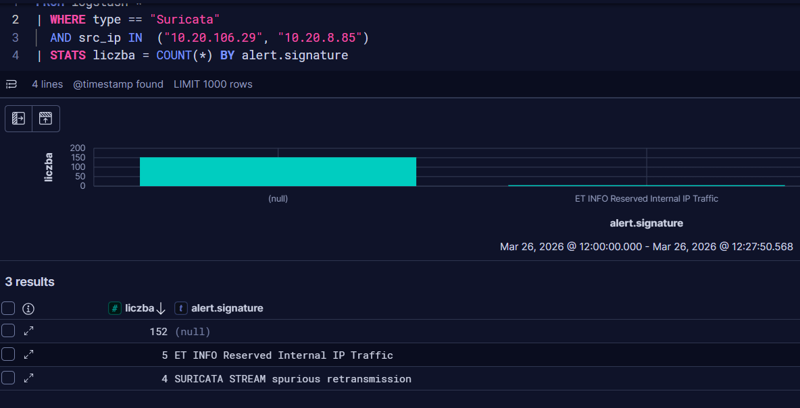
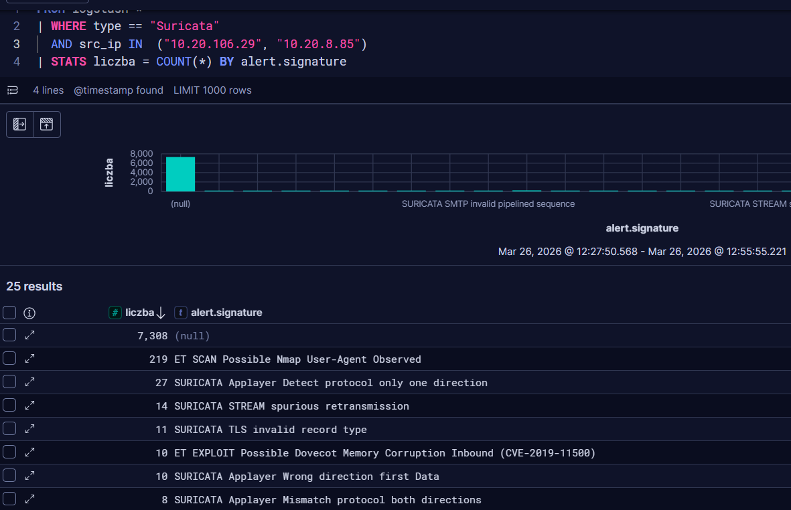
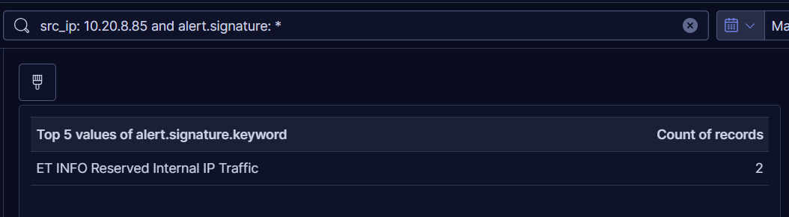
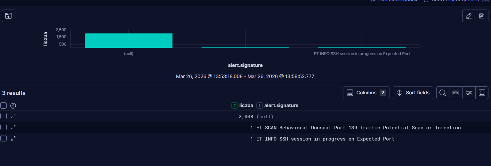

# T1046 — Network Service Discovery (Nmap Scan Detection Gap Analysis)

**Author:** [name or pseudonym]  
**Date:** 2026-03-26  
**Environment:** T-Pot (Suricata) + Kali Linux + Elastic Stack  
**MITRE ATT&CK:** [T1046](https://attack.mitre.org/techniques/T1046/)  
**Status:** Completed

---

## Objective

Simulate four Nmap scanning techniques against a T-Pot honeypot and determine
which techniques trigger Suricata IDS alerts — identifying detection gaps
in signature-based and behavioral detection.

---

## Lab Environment

| 		Component	| 		Role				|
|-------------------------------|-----------------------------------------------|
| T-Pot (Suricata)		| IDS/IPS, attack target — IP: 10.20.124.124	|
| Kali Linux 			| Attacker machine — IP: 10.20.8.85		|
| Elastic Stack + Kibana 	| SIEM — log ingestion and analysis		|

---

## Baseline — Pre-Attack State

Before simulations, Suricata recorded minimal background noise
between 12:00–12:27. Only 3 signatures observed — no scan-related alerts.

| 			Signature		| Count |
|-----------------------------------------------|-------|
| 			(null) 			|  152  |
| ET INFO Reserved Internal IP Traffic 		|   5   |
| SURICATA STREAM spurious retransmission 	|   4   |



---

## Simulations & Results

### Scan 1 — Aggressive (`-A -T4`)
```bash
nmap -A -T4 10.20.124.124
```

Aggressive scan with OS detection, version detection, and script scanning.
Immediately triggered Suricata's Nmap User-Agent signature.

| 		Signature 			|     Count 	|
|-----------------------------------------------|---------------|
| 	SURICATA Ethertype unknown 		| 	5,586 	|
| 	ET INFO Reserved Internal IP Traffic 	| 	278 	|
| **ET SCAN Possible Nmap User-Agent Observed** |	**218**	|
| ET EXPLOIT Possible Dovecot CVE-2019-11500 	| 	10	|
| 			Other 			| 	85	|

> **Note:** `-A` flag triggers version detection which probes services
> aggressively enough to match exploit signatures — without any real
> exploitation attempt.



---

### Scan 2 — SYN Stealth (`-sS -T2`)
```bash
nmap -sS -T2 10.20.124.124
```

SYN stealth scan at reduced timing. Does not complete TCP handshake —
Suricata failed to identify Nmap via User-Agent signature.

| 			Signature		| Count |
|-----------------------------------------------|-------|
| SURICATA Ethertype unknown			| 4,807 |
| ET INFO Reserved Internal IP Traffic 		| 236	|
| ET INFO Spotify P2P Client 			|  50 	|
| **ET SCAN Possible Nmap User-Agent Observed** | **0** |


---

### Scan 3 — Slow Scan (`-sS -T1 --scan-delay 5s`)
```bash
nmap -sS -T1 --scan-delay 5s 10.20.124.124
```

Slowest Nmap timing with 5-second delay between probes —
designed to evade threshold-based detection.
Result identical to Scan 2: no Nmap signature triggered.

| 			Signature		| Count |
|-----------------------------------------------|-------|
| 			(null) 			| 1,273	|
| ET INFO Reserved Internal IP Traffic 		|   2	|
| **ET SCAN Possible Nmap User-Agent Observed** | **0** |



---

### Scan 4 — Decoy (`-D RND:10`)
```bash
nmap -D RND:10 10.20.124.124
```

Decoy scan spoofing 10 random source IPs alongside the real attacker IP.
No Nmap User-Agent detected — however, behavioral detection triggered
on unusual SMB port 139 traffic.

| 				Signature				| Count |
|-----------------------------------------------------------------------|-------|
| 					(null) 				| 2,008	|
| **ET SCAN Behavioral Unusual Port 139 Potential Scan or Infection**	| **1** |
| ET INFO SSH session in progress on Expected Port 			|   1 	|



---

## Detection Gap Analysis

| 		Technique		|ET SCAN Nmap User-Agent| Behavioral Alert	| Detected?	|
|---------------------------------------|-----------------------|-----------------------|---------------|
| `-A -T4` (Aggressive)			|	 218x	 	|	 YES		| 	YES	|
| `-sS -T2` (SYN Stealth) 		|  	0x	 	|	 NO 		|	NO	|
| `-sS -T1 --scan-delay 5s` (Slow) 	| 	 0x		|	 NO 		| 	NO	|
| `-D RND:10` (Decoy) 			|  	0x	 	|     YES (port 139)	|     PARTIAL	|

**Key finding:** Suricata's default ruleset detects Nmap only when
the HTTP User-Agent is exposed (`-A` flag). Pure SYN scans — regardless
of speed — evade signature-based detection entirely. Decoy scanning
partially evades User-Agent detection but leaks behavioral anomalies
on non-standard ports.

---

## SIGMA Detection Rule

File: [`../../detections/sigma/T1046-nmap-network-scan.yml`]
(../../detections/sigma/T1046-nmap-network-scan.yml)

Detection logic: high SYN packet rate to multiple destination ports
from a single source within a short timeframe — catches stealth scans
that evade User-Agent signatures.

---

## Findings & Recommendations

- Signature-based detection alone is insufficient for stealth Nmap scans
- Behavioral rules based on **port sweep patterns** and **SYN rate thresholds**
  are required to detect `-sS` techniques
- Decoy scanning (`-D`) masks attacker IP but generates behavioral anomalies —
  cross-correlating multiple low-confidence alerts improves detection
- Version detection (`-sV`, `-A`) is the loudest Nmap mode and should always
  trigger alerts — validate this in any production SIEM
