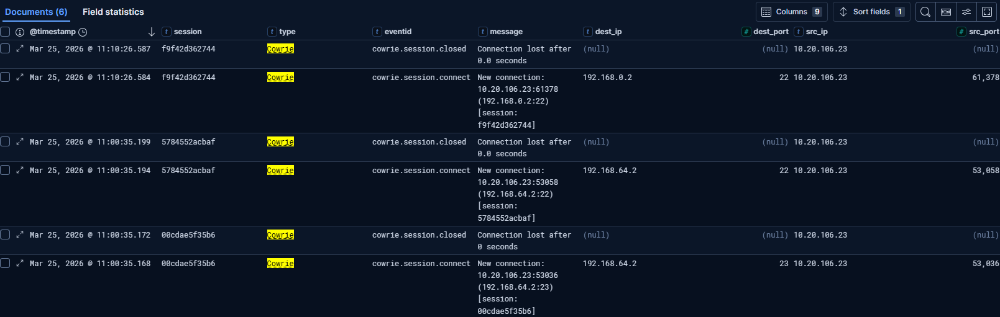
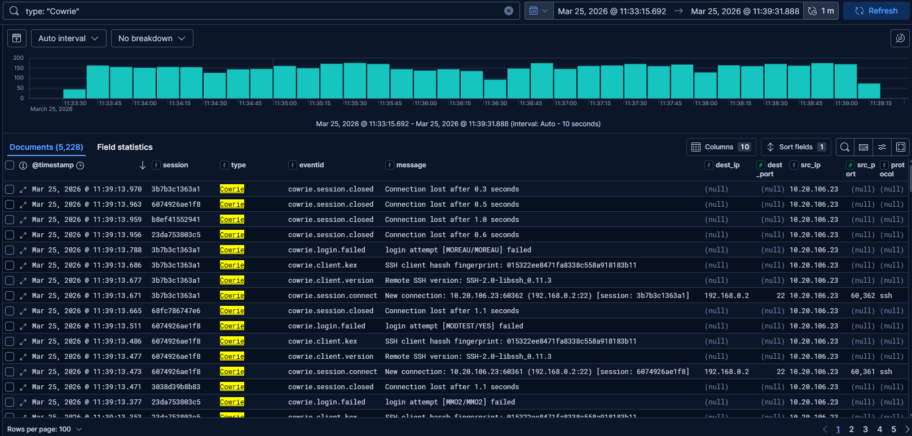
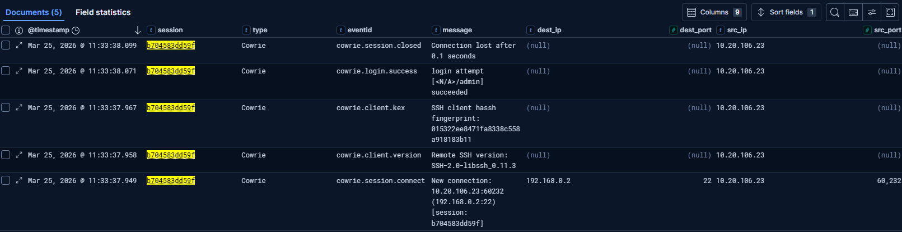

# T1110.001 — SSH Brute Force Detection

**Author:** [name or pseudonym]  
**Date:** 2026-03-25  
**Environment:** T-Pot (Cowrie) + Kali Linux + Elastic Stack  
**MITRE ATT&CK:** [T1110.001](https://attack.mitre.org/techniques/T1110/001/)  
**Status:** Completed

---

## Objective

Simulate an SSH brute force attack against a Cowrie honeypot,
observe and analyze generated logs in Elastic Stack,
and develop a SIGMA detection rule mapping to MITRE ATT&CK T1110.001.

---

## Lab Environment

| Component | Role |
|---------------------------|---------------------------------------------------|
| 		T-Pot (Cowrie) 		| 	SSH honeypot, attack target — IP: 10.20.124.124 |
| 		Kali Linux 			| 	Attacker machine — IP: 10.20.106.23				|
| 	Elastic Stack + Kibana 	| 	SIEM — log ingestion and analysis 				|

---

## Baseline — Pre-Attack State

Before the simulation, T-Pot was passively collecting real-world
internet traffic. Between 09:00–11:32, Cowrie recorded 6 events —
representing organic background noise from external actors.



---

## Attack Simulation

**Tool:** Hydra  
**Wordlist:** Default Credentials list from SecLists,
pre-processed to remove `<BLANK>` entries  
**Command:**
```bash
hydra -C hydraupdated.txt ssh://10.20.124.124 -t 4 -V
```

The wordlist was extracted and cleaned using:
```bash
awk -F',' '{print $2":"$3}' default-passwords.csv \
  | tail -n +2 \
  | grep -v "<BLANK>" > hydraupdated.txt
```

The attack generated **5,228 Cowrie events** within minutes,
compared to 6 events in the baseline window.



---

## Log Analysis

### Event Distribution During Attack

| 			EventID			| Count |
|---------------------------|-------|
| cowrie.login.failed 		| 1,151 |
| cowrie.login.success 		| 1 	|
| cowrie.session.connect 	| 1,022 |
| cowrie.session.closed 	| 1,022 |
| cowrie.client.kex 		| 1,019 |
| cowrie.client.version 	| 1,019 |

### Session Analysis — b704583dd59f

Hydra matched credentials `<N/A>:admin`, triggering a
`cowrie.login.success` event. Session timeline:

|	Timestamp 	| 			EventID 		|
|---------------|---------------------------|
| 11:33:37.949 	| cowrie.session.connect	|
| 11:33:37.958 	| cowrie.client.version	 	|
| 11:33:37.967 	| cowrie.client.kex 		|
| 11:33:38.071 	| cowrie.login.success 		|
| 11:33:38.099 	| cowrie.session.closed 	|

**Session duration: 132ms. No `cowrie.command.input` observed.**

Hydra confirmed valid credentials and disconnected automatically —
consistent with credential harvesting behavior,
not interactive post-exploitation.



> **Note:** `cowrie.login.success` does not indicate real
> system compromise. Cowrie intentionally accepts certain
> credentials to engage attackers in a controlled fake shell
> environment. Always correlate with `cowrie.command.input`
> events to assess post-login activity.

---

## SIGMA Detection Rule

File: [`../../detections/sigma/T1110.001-ssh-brute-force.yml`]
(../../detections/sigma/T1110.001-ssh-brute-force.yml)

**Detection logic:** More than 5 `cowrie.login.failed` events
from a single `src_ip` within a 1-minute window.

---

## Findings

- Detection rule fires as expected: **YES**
- Threshold of 5 failures / 1 min reduces false positives
  from legitimate admin mistyping
- `cowrie.login.success` requires session context to assess
  real impact — standalone it is misleading
- Hydra's SSH client fingerprint (`libssh_0.11.3`) is visible
  in `cowrie.client.version` — useful for threat intel correlation